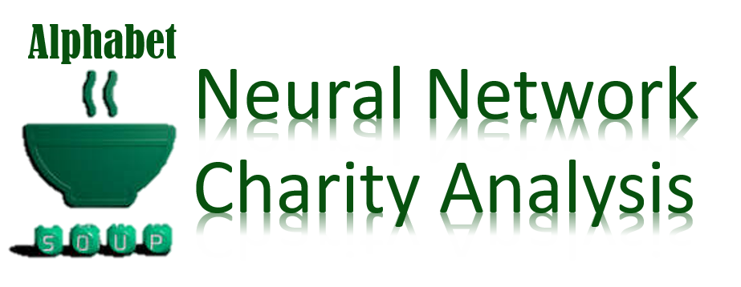
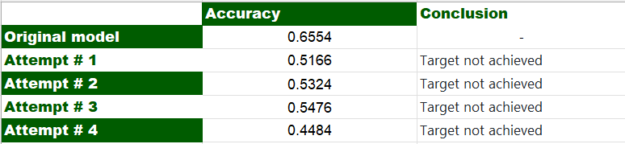

 

# Neural_Network_Charity_Analysis

# Overview
Alphabet Soup, a nonprofit philanthropic foundation dedicated to helping organizations that protect the environment, improve people's well-being, and unify the world. Alphabet Soup has raised and donated over 10 billion dollars in the past 20 years. This money has been used to invest in lifesaving technologies and organize reforestation groups around the world.

Our job is to analyze the impact of each donation and vet potential recipients. This helps ensure that the foundation's money is being used effectively. Unfortunately, not every donation the company makes is impactful. In some cases, an organization will take the money and disappear. We have been asked to predict which organizations are worth donating to and which are too high risk.

Using Machine Learning and Neural Networks, create a binary classifier that is capable of predicting whether applicants will be successful if funded by Alphabet Soup.

# Results
## Data Preprocessing
What variable(s) are considered the target(s) for your model?

IS_SUCCESSFUL-was the money used effectively

What variable(s) are considered to be the features for your model?

APPLICATION_TYPE -Alphabet Soup application type

AFFILIATION -Affiliated sector of industry

CLASSIFICATION -Government organization classification

USE_CASE -Use case for funding

ORGANIZATION -Organization type

STATUS—Active status

INCOME_AMT—Income classification

SPECIAL_CONSIDERATIONS—Special consideration for application

ASK_AMT—Funding amount requested

What variable(s) are neither targets nor features, and should be removed from the input data?

EIN and NAME—Identification columns

## Compiling, Training, and Evaluating the Model

How many neurons, layers, and activation functions did you select for your neural network model, and why?

* Attempt # 1
Used original model neurons, layers, and activation functions-changed bin sizes.

* Attempt # 2
Increased to 3 hidden layers.

* Attempt # 3
Changed activation functions to linear, relu, and tanh.

* Attempt # 4
Increased neurons from 8:5 to 10:8 and changed activation functions from relu:relu to relu:tanh.

###  Were you able to achieve the target model performance?

 

###  What steps did you take to try and increase model performance?
Attempt # 1
Changed bin sizes for APPLICATION_TYPE and CLASSIFICATION from original model
Attempt # 2
Added in third hidden layer from Attempt # 1
Attempt # 3
Changed activation functions from Attempt # 2
Attempt # 4
Changed number of neurons and activation functions from original model
# Summary
Only one attempt improved the accuracy of the model but did not reach the 75% target. Further exploration and trials would need to be done to find the optimal parameters for a model that achieved an accuracy of 75% or greater.

